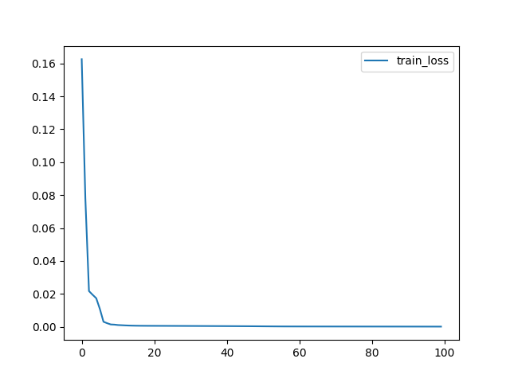
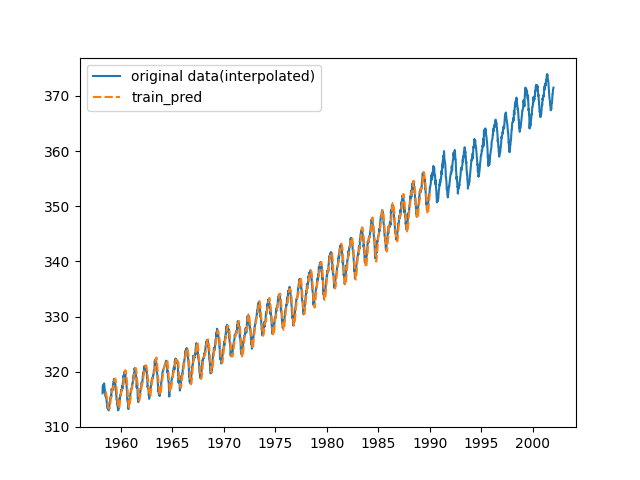
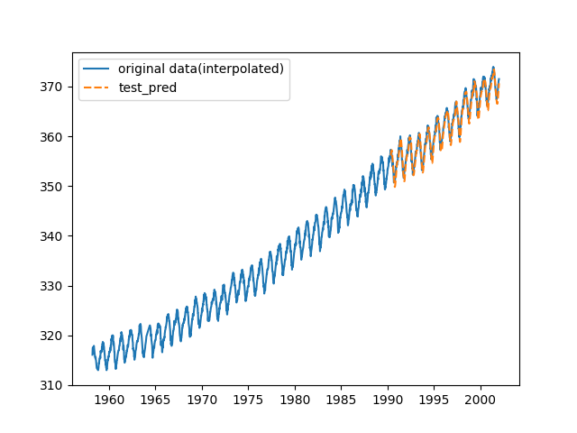

# Implementation LSTM model with PyTorch

## Preparing Environment

```
$ docker-compose build
$ docker-compose up -d
# cd /work
```

## Time-series forecasting

Training LSTM model to predict atmospheric CO2 dataset with PyTorch.

### Usage

```
$ python3 main.py
```

#### Train result

Trained model is saved to output directory (default is ``./output``).

```
=================================================================
Layer (type:depth-idx)                   Param #
=================================================================
LSTM                                     --
├─LSTM: 1-1                              17,152
├─Linear: 1-2                            65
=================================================================
Total params: 17,217
Trainable params: 17,217
Non-trainable params: 0
=================================================================
Epoch: 0001, train loss: 0.16255094
Epoch: 0101, train loss: 0.00110254
Epoch: 0201, train loss: 0.00061126
Epoch: 0301, train loss: 0.00053477
Epoch: 0401, train loss: 0.00044236
Epoch: 0501, train loss: 0.00031149
Epoch: 0601, train loss: 0.00022180
Epoch: 0701, train loss: 0.00020237
Epoch: 0801, train loss: 0.00018308
Epoch: 0901, train loss: 0.00016283
Train MSE: 0.00013930467201024103
Test MSE: 0.00017532304271192207
```



#### Evaluation result

- Train MSE: 0.00013930467201024103

- Test MSE: 0.00017532304271192207

